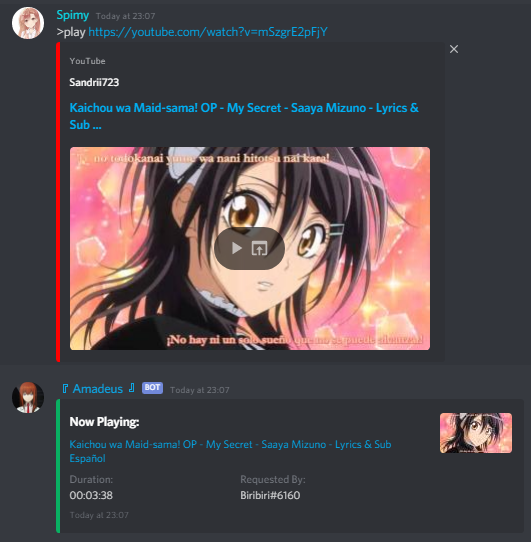
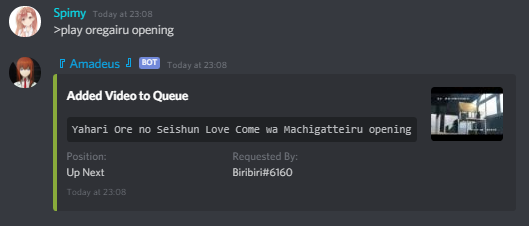
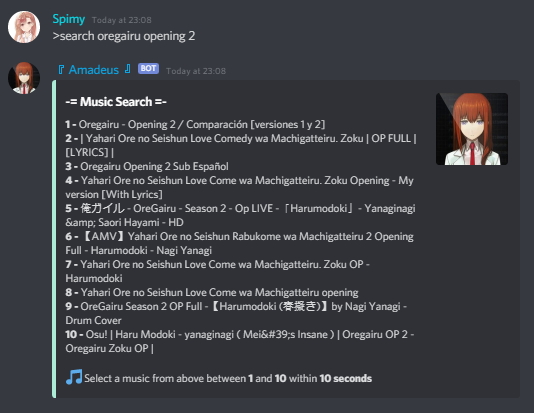
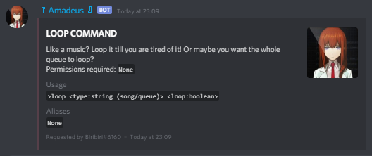
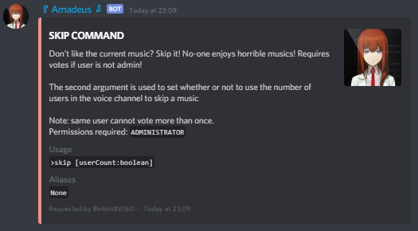
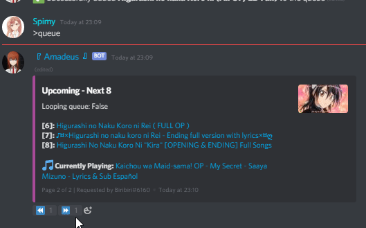
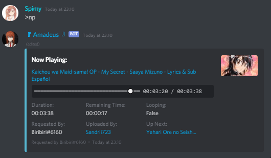
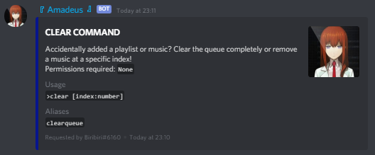
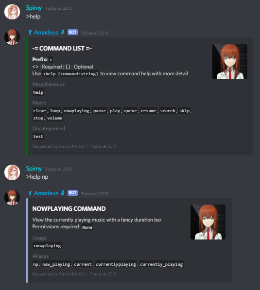

# Muse (μ's) CLI

\
[](https://discord.gg/865tNC4)

MuseCLI generates a discord.js bot with music features for you! You can use the `generate` subcommand to automatically generate boilerplate codes for commands and events so you don't have to keep rewriting repeated codes!

**NOTICE:** If the bot crashes or music randomly gets skipped with errors similar to `Error: Too many redirects` then
the error comes from YTDL and I am not responsible for any issues related to said library. If any issues of the like
persists, open an issue on their [GitHub page](https://github.com/Snowflake107/discord-ytdl-core/issues/).

## Requirements

- [NodeJS](https://nodejs.org/)
- [FFmpeg](https://www.ffmpeg.org/)

## Commands
- Start a new project:\
    `muse (n)ew <project-name> <template> [--git] [--skipInstall] [--packageManager=(npm/yarn)]`
    
    Templates currently available: TypeScript

- Generate a new component: \
    `muse (g)enerate <component> <component_name>`

    Components available: `command` and `event`\
    Component name supports relative path, e.g: `admin/ban` will create a ban `command` inside the `admin` folder

## Features

- Multiple Ways to Start Music:
    1. Play with YouTube video links (also supports YouTube playlist links):\
    

    1. Play with search query:\
    

    1. Play using search command to make a selection from 10 results:\
    

- Video and Queue Loop:\
    You can make a video or a queue loop.

    If video is looping, it will never jump to the next video unless you turn if off or skip the song\
    If queue is looping, the entire queue will never end. This is done by pushing the current video to the
    end of the queue array when it finishes playing

    

- Vote Skip if not Admin:\
    

- Paginated Queue Embed:\
    Each page contains up to 5 videos so you need at least 6 videos in the queue for pagination to start\
    The reactor for pagination lasts for 60 seconds. If 60 seconds have passed, rerun the `queue` command for
    pagination to work again\
    

- Duration Bar:\
    Updates every 5 seconds to avoid rate limit\
    

- Clear Whole Queue or Video at Specified Index:\
    

- Responsive Help Message:\
    

## Installation Instructions

- Fork this repo
- Clone your fork to your local machine
- CD into the bot's root directory
- Run `npm install` or `yarn`

OR

- Run `npm install -g muse-cli` or `yarn global add muse-cli`
- Run `muse new project-name typescript [--git] [--skipInstall] [--packageManager=(npm/yarn)]`

THEN FOR EITHER

- Copy your [discord token](#getting-a-discord-bot-token) and [YouTube API Key](https://console.cloud.google.com/apis/library/youtube.googleapis.com?id=125bab65-cfb6-4f25-9826-4dcc309bc508) into a `.env` file in project root folder
```
TOKEN=bot_token
YOUTUBE_API_KEY=api_key
```
- Set a command prefix in into [muse.json](muse.json)
- Run `npm build` or `yarn build` or `tsc -b`
- Run `npm dev` or `yarn dev` and if you do, skip the next step
- Run `npm start` or `yarn start` or `node dist/index.js`

## Getting a Discord Bot Token

- Head on over to [Discord's Developer Page](https://discordapp.com/developers/applications/)
- Sign in with your Discord account, if you are not already signed in
- Click the "New Application" button
- Give the application a name
- On the "General Information" Tab, give your application an avatar image
- Click the bot tab on the left hand side menu
- Then click "Add Bot" & confirm by clicking "Yes, Do it"
- Finally, copy the bot token

Note: Do NOT share your bot token with anyone!


## Command File Template

```js
@Command({
    name: '', // The name of the command
    aliases: [], // Add aliases inside the array (Optional)
    category: '', // Specify which category this command belongs to (Optional)
    usage: '', // Specify the arguments taken by the command (Optional)
    description: '', // A short description about your command (Optional)
    permissions: [], // Add permissions required to run the command (Optional)
    overrideDefaultPermCheck: false // Whether to ignore default permission check (Optional)
})
default class implements CommandExecutor {

    execute = async (message: Message, args: string[]): Promise<boolean> => {
        // Command code in here
        return true;
    }

}
```
OR

Use `muse generate command <command_name>` to generate boilerplate for a command

## Event File Template

```js
@Event('') // The name of the event
default class implements EventListener {

    listen = async (/* Pass in appropriate arguments for the event name passed in the decorator */) => {
        // Event code in here
    }

}
```
OR

Use `muse generate event <event_name>` to generate boilerplate for an event


## Author

[Spimy:](https://github.com/Spimy)

- Discord: Biribiri#6160
- YouTube: <https://www.youtube.com/channel/UCNfE0E97k3fouJg-2nulLKg>
- Twitter: <https://twitter.com/OfficialSpimy>
- Instagram: <http://instagram.com/OfficialSpimy>

## Support Server

[](https://discord.gg/865tNC4)
